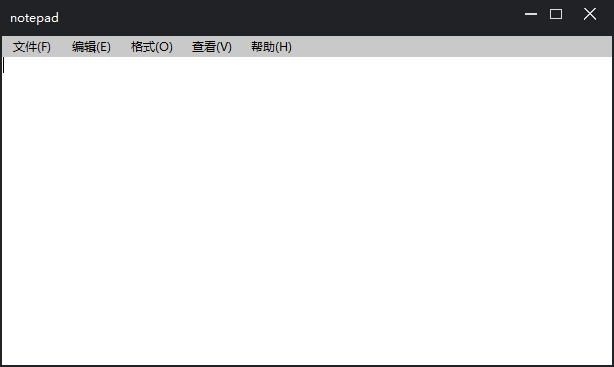

### 简介：
使用sintilla和duilib编写的小工具，功能和window记事本类似。  

### 编译：  
需要安装Visual Studio 2017，默认项目中已经配置好所需要的依赖库，编译即可。  
配置：  
Duilib_Static（Debug、Release、UnicodeDebug、UnicodeRelease）  
Scintilla（Debug、Release）  
w（Debug、Release）  

### 运行环境：  
window7、10  

### 关于作者：  
https://space.bilibili.com/273436120
